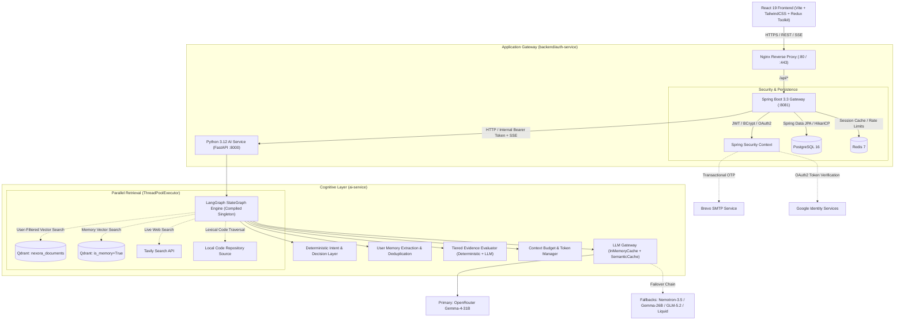
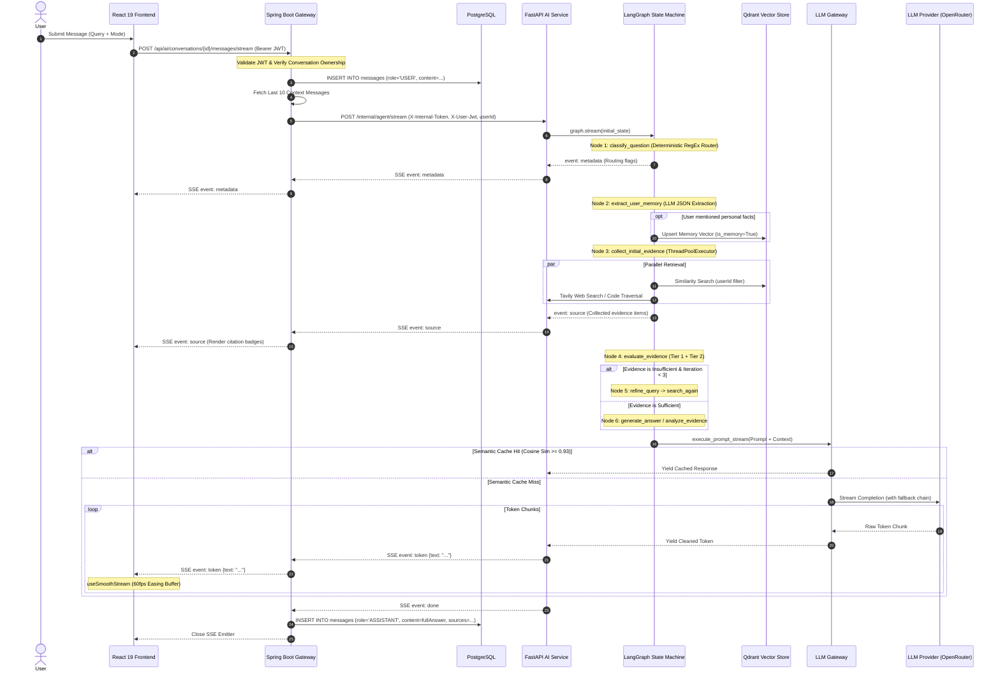
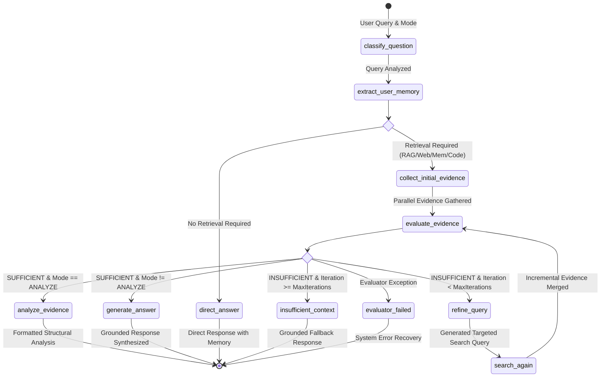
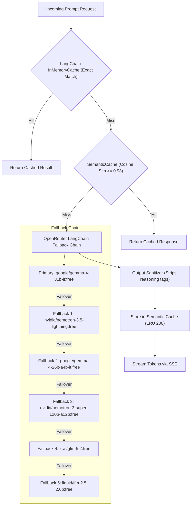

# ThinkAction AI

<div align="center">

**An agentic AI workspace combining multi-agent reasoning, iterative evidence evaluation, persistent semantic memory, codebase retrieval, and retrieval-augmented generation (RAG) across a distributed Spring Boot and FastAPI architecture.**

[](https://thinkactionai.netlify.app/)
[](https://react.dev/)
[](https://spring.io/projects/spring-boot)
[](https://fastapi.tiangolo.com/)
[](https://qdrant.tech/)
[](https://www.postgresql.org/)
[](https://redis.io/)

</div>

---

## 1. System Overview

### What is ThinkAction AI?
ThinkAction AI is an open-source **Agentic AI Workspace**. Rather than acting as a simple wrapper over a raw LLM API, ThinkAction AI treats large language models as one component within a state-machine-controlled cognitive workflow.

The platform coordinates multi-source retrieval (uploaded documents, live web search, persistent user memory, and local codebase search), executes tiered evidence evaluation, manages token context budgets, handles automated multi-model failover, and streams responses to a React workbench via Server-Sent Events (SSE).

```
                      ┌──────────────────────────────────────────────┐
                      │              ThinkAction AI                  │
                      │  Unified Multi-Agent Cognitive Architecture  │
                      └──────────────────────┬───────────────────────┘
                                             │
      ┌──────────────────┬───────────────────┼───────────────────┬──────────────────┐
      ▼                  ▼                   ▼                   ▼                  ▼
┌───────────┐      ┌───────────┐       ┌───────────┐       ┌───────────┐      ┌───────────┐
│  General  │      │  Deep Web │       │ Document  │       │Structural │      │ Codebase  │
│   Chat    │      │ Research  │       │ Knowledge │       │ Analysis  │      │ Retrieval │
│ (Memory)  │      │  (Tavily) │       │ (Qdrant)  │       │(Validator)│      │(Traversal)│
└───────────┘      └───────────┘       └───────────┘       └───────────┘      └───────────┘
```

### Who is it for?
* **Engineers & Researchers:** Who require responses grounded in verifiable citations, uploaded documents, local source code, and live web research.
* **Technical Teams:** Ingesting project documentation, technical specifications, and architectural notes with user-scoped vector retrieval.
* **Developers & Architects:** Exploring a reference implementation of a distributed **Java/Spring Boot + Python/FastAPI + LangGraph** architecture.

### Why is it different?
1. **Deterministic Heuristics Before Generation:** Prompting an LLM to decide routing for every request introduces unnecessary latency and token cost. ThinkAction AI evaluates deterministic intent patterns and keyword heuristics before invoking model reasoning.
2. **Tiered Evidence Evaluation & Query Refinement:** Retrieved context is checked for sufficiency. If evidence is lacking, the LangGraph state machine extracts missing information, formulates an expanded query, and iteratively re-searches up to bounded limits.
3. **Persistent Semantic User Memory:** Distinguishes between ephemeral conversation history and long-term user profile facts. Factual statements are extracted into structured JSON, deduplicated against existing knowledge, and persisted in Qdrant.
4. **Dual-Layer Caching:** Combines exact-match in-memory caching with a thread-safe cosine-similarity semantic query cache ($0.93$ similarity threshold) to resolve common rephrasings without upstream model calls.
5. **Output Grounding Validation:** An analysis validation layer scans generated text to detect and flag fabricated URLs, ungrounded dates, and unacknowledged contradictions against retrieved evidence.

---

## 2. Core Capabilities

| Capability | Modality / Mode | What It Does | Internal Workflow |
| :--- | :--- | :--- | :--- |
| **General Assistant** | `CHAT` | Conversational assistant with personalized memory injection. | Extracts user facts, injects active user memories into the system prompt, and generates direct responses. |
| **Web Research** | `RESEARCH` | Live internet research and synthesis. | Queries the Tavily Search API, deduplicates sources, validates URLs, and synthesizes an up-to-date summary with citations. |
| **Document Knowledge** | `RAG` | Retrieval-augmented generation over ingested files. | Splits documents into chunks (500 chars), embeds via `all-MiniLM-L6-v2`, and performs user-filtered vector similarity search in Qdrant. |
| **Structured Analysis** | `ANALYZE` | Multi-perspective comparative reasoning. | Gathers multi-source evidence, preserves contradiction candidates (Jaccard lexical overlap $> 0.40$), and runs output validation. |
| **Implementation Planning** | `PLAN` | Structured roadmap and milestone decomposition. | Breaks technical objectives into ordered implementation milestones using domain-tuned system prompts. |
| **Codebase Retrieval** | `CODE_RESEARCHER` | Local repository exploration and symbol matching. | Traverses repository files, skips ignored directories, matches path and content keywords, and extracts context windows with surrounding lines. |

---

## 3. System Architecture

ThinkAction AI is architected as a distributed two-service application with a Java Spring Boot backend gateway and a Python FastAPI cognitive service, communicating over an internal container network.



---

## 4. End-to-End Request Lifecycle

The diagram below illustrates the path of a Server-Sent Events (SSE) streaming request from the user interface to the LLM and back:



---

## 5. LangGraph Orchestration & Cognitive State Machine

The orchestration logic in `ai-service/app/agent/graph.py` is implemented as a compiled cyclic `StateGraph` using an immutable `AgentState` schema.



### Graph Execution Nodes
* **`classify_question`**: Evaluates the incoming prompt against compiled regex pattern groups (`_RAG_PATTERNS`, `_WEB_PATTERNS`, `_MEMORY_PATTERNS`, `_CODE_PATTERNS`, `_PLAN_PATTERNS`, `IDENTITY_PHRASES`). Sets flags indicating which retrieval tools are needed without making an LLM call.
* **`extract_user_memory`**: Scans for first-person factual statements. Prompts the LLM to output a JSON payload with `extracted_fact` and conflicting `delete_ids`, updating Qdrant memory vectors accordingly.
* **`collect_initial_evidence`**: Uses Python's `concurrent.futures.ThreadPoolExecutor(max_workers=4)` to parallelize I/O across Qdrant vector retrieval, live web search, and local codebase search. Evidence items are deduplicated using MD5 content hashing.
* **`evaluate_evidence`**: Runs a two-tier evaluation:
  * **Tier 1 (Deterministic):** Rejects empty results, total content $<100$ characters, or items where all scores fall below the minimum threshold ($0.30$).
  * **Tier 2 (LLM):** If ambiguous, prompts the model to return `{sufficient: bool, reason: str, missing_information: list}`.
* **`refine_query` & `search_again`**: When evidence is deemed insufficient, extracts the missing semantic dimensions, constructs a targeted query, and re-executes search up to `max_iterations = 3`.
* **`analyze_evidence`**: Applies deterministic evidence sorting (user memory $\to$ documents $\to$ web) and preserves contradiction candidates (Jaccard lexical overlap $> 0.40$) for structured analysis.
* **`generate_answer`**: Formats the selected evidence into the prompt template, includes relevant user memories in the system prompt, and prepares the execution payload for streaming.

---

## 6. Core Subsystems Deep Dive

### A. RAG Architecture & Vector Retrieval
* **Document Ingestion (`document_processor.py`):** Extracts text from PDF, TXT, MD, and DOCX files, normalizing whitespace and formatting.
* **Chunking (`chunker.py`):** `CharacterChunker` splits text into chunks of `chunk_size = 500` characters with `chunk_overlap = 50` characters, respecting structural boundaries (`\n\n` $\to$ `\n` $\to$ whitespace).
* **Embedding Model (`embedding.py`):** Local `sentence-transformers` running `all-MiniLM-L6-v2` generating 384-dimensional dense vectors on CPU. Features a bound LRU cache (`maxsize=512`) on single query embeddings to avoid re-encoding identical queries.
* **Vector Store (`vector_store.py`):** Stores chunk embeddings in the Qdrant collection `nexora_documents`.
* **User-Scoped Retrieval:** Every search and delete query applies a mandatory payload filter:
  ```python
  user_filter = Filter(must=[FieldCondition(key="user_id", match=MatchValue(value=user_id))])
  ```
* **Deterministic Point IDs:** Vector UUIDs are computed via `uuid.uuid5(NAMESPACE_OID, f"{user_id}:{document_id}:{chunk_index}")`.

---

### B. Persistent Semantic User Memory
ThinkAction AI separates **session conversation history** (stored relationally in PostgreSQL) from **long-term semantic memory** (stored as vector embeddings in Qdrant).

```
User Query: "I prefer working with Spring Boot instead of Django."
      │
      ▼
classify_question ──► extract_user_memory (LLM JSON Extraction)
                              │
                              ▼
                {
                  "extracted_fact": "User prefers working with Spring Boot instead of Django",
                  "delete_ids": ["prev-uuid-django-preference"]
                }
                              │
            ┌─────────────────┴─────────────────┐
            ▼                                   ▼
Qdrant: Delete conflicting IDs        Qdrant: Upsert new vector
                                      (payload: is_memory=True)
```
On subsequent requests, user memories are retrieved and injected into the LLM system prompt:
```text
Here are personal facts you know about this user:
- User prefers working with Spring Boot instead of Django
```

---

### C. Codebase Retrieval
`CodeRetrievalService` (`code_retrieval.py`) provides localized repository search:
* **Directory Filtering:** Scans the workspace directory, skipping `.git`, `node_modules`, `target`, `venv`, `__pycache__`, `build`, `dist`, `.idea`, and `.vscode`.
* **Heuristic Scoring:** Computes relevance scores based on file path matches ($+0.5$) and exact keyword line matches ($+1.0$).
* **Context Extraction:** Extracts a window of $\pm 15$ lines around keyword matches and heuristically identifies enclosing class or function headers (`_guess_symbol`).
* **Execution Boundary:** Enforces a 5.0-second safety timeout per search to prevent I/O blocking.

---

### D. LLM Gateway, Fallback Chain & Semantic Caching
The Python `LLMGateway` (`llm_gateway.py`) wraps model calls with multi-tier caching and automated failover.



* **Cache Key Extraction:** Embeds *only* the user's core query rather than the entire prompt wrapper, preventing large RAG context blocks from falsely inflating similarity scores across different questions.
* **Semantic Cache (`semantic_cache.py`):** Maintains an in-memory `OrderedDict` (capacity: 200 entries, thread-safe via `threading.Lock`). Computes vector cosine similarity; matches with similarity $\ge 0.93$ return cached content directly.
* **Reasoning Sanitizer:** Strips `<think>...</think>` tags and reasoning artifacts emitted by thinking models before dispatching tokens downstream.

---

### E. Context Budgeting & Token Management
`ContextManagerService` (`context_manager.py`) manages prompt token allocation:
* **Token Estimation:** Calculates approximate token counts using character-to-token heuristics.
* **Budget Limits:** Configured with a default limit of $3,500$ input tokens and $1,000$ reserved output tokens.
* **Evidence Constraints:**
  * `safety_max_rag_chunks`: 5 chunks maximum
  * `safety_max_chars_per_rag_chunk`: 1,200 characters maximum
  * `safety_max_web_results`: 5 results maximum
  * `safety_max_chars_per_web_result`: 1,000 characters maximum
  * `safety_max_total_evidence_chars`: 6,000 characters maximum
* **Truncation:** Appends `"... [truncated]"` when individual content blocks exceed allocated limits.

---

### F. Output Validation & Grounding Checks
`AnalysisOutputValidator` (`validator.py`) inspects generated responses against the retrieved evidence set before final delivery:
1. **Fabricated URL Detection:** Extracts HTTP/HTTPS links from the generated text and flags any URL not present in the retrieved evidence objects.
2. **Fabricated Date Detection:** Checks generated date references against evidence publication dates and content.
3. **Certainty Checking:** Emits warnings if absolute assertions (`"definitely"`, `"always"`, `"proves"`) appear without supporting evidence.
4. **Contradiction Verification:** Verifies whether conflicting evidence sources were acknowledged in the final response.

---

## 7. Streaming Protocol (Server-Sent Events)

ThinkAction AI streams real-time updates over HTTP using Server-Sent Events (SSE). The Python service emits structured event blocks to Spring Boot, which relays them downstream with buffering disabled (`X-Accel-Buffering: no`).

| Event Type | Payload Schema | Description |
| :--- | :--- | :--- |
| `start` | `{}` | Handshake signal confirming graph execution has started |
| `status` | `{"stage": "classify_question" \| "collect_initial_evidence" \| ...}` | Stage transition updates for frontend progress indicators |
| `metadata` | `{"needsWeb": bool, "needsRag": bool, "needsMemory": bool, ...}` | Emitted after intent classification to show active tools |
| `source` | `{"title": str, "url": str, "source_type": str, "relevance_score": float}` | Evidence citation objects emitted prior to text generation |
| `token` | `{"text": "token_chunk"}` | Incremental token chunks generated by the LLM |
| `done` | `{}` | Completion signal closing the HTTP stream |

```
Client (useSmoothStream) ◄── SSE Tokens ◄── Spring Boot (SseEmitter) ◄── FastAPI (StreamingResponse)
```

On the frontend, the React hook `useSmoothStream.js` buffers incoming chunks and interpolates token rendering via a `requestAnimationFrame` easing loop at 60fps, smoothing out network-level chunk burstiness.

---

## 8. Security & Isolation Model

### Implemented Controls
* **Stateless JWT Authentication:** Access tokens signed via HMAC-SHA256 with role-based authorization (`USER`, `ADMIN`).
* **Internal Service Authentication:** Communication between Spring Boot and FastAPI is authenticated using a shared bearer token (`X-Internal-Token`) and propagated user context (`X-User-Jwt`).
* **User-Scoped Vector Filtering:** Qdrant search and deletion operations require an explicit `user_id` payload match.
* **SSRF URL Filtering:** Web search tools validate outbound URLs, rejecting `localhost`, `127.0.0.1`, `0.0.0.0`, and non-HTTP schemes.
* **Parameterized Persistence:** Relational database access uses Spring Data JPA parameterized queries and Hibernate ORM.
* **Environment-Based Secrets:** Secrets and API keys are injected via environment variables rather than hardcoded in source files.

### Production Hardening Considerations
* Mutual TLS (mTLS) between internal Spring Boot and FastAPI service boundaries.
* Gateway-level distributed rate limiting backed by Redis across all public endpoints.
* Secrets rotation via a dedicated secrets manager (e.g. AWS Secrets Manager or HashiCorp Vault).
* Content Security Policy (CSP) headers and cross-origin resource sharing (CORS) domain lock-downs for production domains.

---

## 9. Data Architecture

| Storage Engine | Technology | Responsibility | Persistence Model |
| :--- | :--- | :--- | :--- |
| **Relational DB** | PostgreSQL 16 | User accounts, password hashes, conversation sessions, chat messages, document metadata | ACID Transactions / Volume Mount |
| **Vector DB** | Qdrant | 384-dimensional dense vectors for RAG document chunks and user memories | Disk-backed storage volume |
| **Cache & State** | Redis 7 | User rate limiting, OTP verification codes, Spring cache | In-memory with AOF persistence |
| **Local Cache** | Python In-Memory | Exact-match prompt cache (`InMemoryCache`) + Cosine semantic query cache (`SemanticCache`) | Ephemeral process memory (200 entries) |

---

## 10. Technology Stack

<div align="center">

| Layer | Technologies |
| :--- | :--- |
| **Frontend** | React 19, Vite 6, TailwindCSS, Redux Toolkit, React Router 6, Framer Motion, Lucide Icons |
| **Backend Gateway** | Java 17, Spring Boot 3.3, Spring Security 6 (JWT), Spring Data JPA, Hibernate, HikariCP, Lombok |
| **AI Orchestration** | Python 3.12, FastAPI, LangGraph 0.2, LangChain Core, Pydantic v2, Uvicorn |
| **Vector & ML** | Qdrant, Sentence-Transformers (`all-MiniLM-L6-v2`), PyTorch (CPU), NumPy |
| **External APIs** | OpenRouter (Gemma / Nemotron / GLM), Tavily Search API, Brevo SMTP, Google OAuth2 |
| **Infrastructure** | Docker, Docker Compose, Nginx 1.27 (Alpine), AWS EC2, Netlify |
| **Testing & Metrics** | Pytest, JUnit 5, Mockito, k6 Load Testing, Spring Boot Actuator, Micrometer Prometheus |

</div>

---

## 11. Repository Structure

```text
event-management-system/
├── frontend/                     # React 19 Client Application
│   ├── public/                   # Favicons, SVGs, webmanifest, static assets
│   ├── src/
│   │   ├── components/           # UI components, Chat interfaces, Navbar, Footer
│   │   ├── hooks/                # Custom hooks (useAgentStream, useSmoothStream)
│   │   ├── pages/                # Workspace, Dashboard, Knowledge, Profile, Auth
│   │   ├── store/                # Redux Toolkit slices (authSlice, chatSlice)
│   │   └── api/                  # Axios HTTP client configuration
│   └── package.json
│
├── backend/                      # Spring Boot 3.3 Gateway & Services
│   ├── auth-service/             # Main Application Core
│   │   └── src/main/java/com/EventmanagementbyMahesh/event/
│   │       ├── ai/               # AI Controllers (Conversation, Document, Memory)
│   │       ├── auth/             # Spring Security, JWT Filters, OAuth2, OTP
│   │       └── common/           # Error handling, global exceptions, utilities
│   ├── common-library/           # Shared DTOs and security abstractions
│   ├── docker-compose.yml        # Multi-container service composition
│   └── pom.xml                   # Maven root project definition
│
├── ai-service/                   # Python 3.12 Cognitive AI Microservice
│   ├── app/
│   │   ├── agent/                # LangGraph StateGraph, Evaluator, Validator, Tools
│   │   ├── api/                  # FastAPI endpoints (/internal/agent, /internal/rag)
│   │   ├── core/                 # App configuration & settings
│   │   ├── models/               # Pydantic schemas (AgentState, EvidenceItem, DTOs)
│   │   └── services/             # LLM Gateway, Semantic Cache, Chunker, Vector Store
│   ├── tests/                    # 31 Pytest test suites (Graph, RAG, Memory, Security)
│   └── requirements.txt          # Python dependencies
│
├── docs/                         # Architectural documentation and deployment guides
│   ├── benchmark/                # Empirical benchmark reports and load tests
│   └── AWS_DEPLOYMENT_GUIDE.md   # EC2 & Docker production deployment manual
│
└── README.md                     # Root technical documentation
```

> *Note: Certain directory paths (e.g. `event-management-system/`) and Java package namespaces (`com.EventmanagementbyMahesh.event`) reflect the project's historical repository structure while representing the ThinkAction AI platform.*

---

## 12. Local Development & Setup

### Prerequisites
* **Docker & Docker Compose** (v24.0+)
* **Java Development Kit (JDK 17)** + Maven 3.9+
* **Python 3.12** + `pip`
* **Node.js 20+** + `npm`

---

### Step 1: Clone Repository
```bash
git clone https://github.com/Mahesh5f4/Nexora.git thinkaction-ai
cd thinkaction-ai/event-management-system
```

---

### Step 2: Configure Environment Variables

Create `backend/.env`:
```env
SPRING_DATASOURCE_URL=jdbc:postgresql://localhost:5432/nexora
POSTGRES_USER=nexora
POSTGRES_PASSWORD=<local-database-password>
SPRING_REDIS_URL=redis://localhost:6379
GOOGLE_CLIENT_ID=<your-google-client-id>
BREVO_API_KEY=<your-brevo-api-key>
SPRING_MAIL_USERNAME=<your-email-address>
SPRING_MAIL_PASSWORD=<your-smtp-password>
SPRING_MAIL_FROM=noreply@example.com
AI_SERVICE_INTERNAL_TOKEN=<generate-a-local-dev-token>
AI_SERVICE_URL=http://localhost:8000
```

Create `ai-service/.env`:
```env
OPENROUTER_API_KEY=<your-openrouter-api-key>
QDRANT_URL=http://localhost:6333
TAVILY_API_KEY=<your-tavily-api-key>
AI_SERVICE_INTERNAL_TOKEN=<generate-a-local-dev-token>
SPRING_AI_GATEWAY_URL=http://localhost:8081
```

Create `frontend/.env`:
```env
VITE_API_URL=http://localhost:8081/api
```

> *Note: The values above are local development placeholders. Never commit `.env` files containing real production secrets to version control.*

---

### Step 3: Start Infrastructure Services (Docker)
Launch PostgreSQL, Redis, and Qdrant:
```bash
docker compose -f backend/docker-compose.yml up -d postgres redis qdrant
```

---

### Step 4: Run Application Services Locally

**Terminal 1 — Spring Boot Backend:**
```bash
cd backend
./mvnw spring-boot:run -pl auth-service
```
*Backend runs on `http://localhost:8081` (Context path: `/api`)*

**Terminal 2 — Python AI Service:**
```bash
cd ai-service
python -m venv venv
# Windows:
.\venv\Scripts\activate
# Linux/macOS:
source venv/bin/activate

pip install -r requirements.txt
uvicorn app.main:app --port 8000 --reload
```
*AI Service runs on `http://localhost:8000` (OpenAPI Docs: `/docs`)*

**Terminal 3 — React Frontend:**
```bash
cd frontend
npm install
npm run dev
```
*Frontend runs on `http://localhost:5173`*

---

## 13. Representative API Specification

### Authentication & User Management
| Method | Endpoint | Description | Auth Required |
| :--- | :--- | :--- | :--- |
| `POST` | `/api/auth/register` | Register a new user account | Public |
| `POST` | `/api/auth/login` | Authenticate credentials and issue JWT | Public |
| `POST` | `/api/auth/google` | Authenticate via Google OAuth2 ID token | Public |
| `POST` | `/api/auth/send-otp` | Trigger email verification OTP via Brevo | Public |
| `GET` | `/api/auth/me` | Retrieve authenticated user profile | User JWT |

### AI Conversation & Streaming
| Method | Endpoint | Description | Auth Required |
| :--- | :--- | :--- | :--- |
| `GET` | `/api/ai/conversations` | List user conversation sessions | User JWT |
| `POST` | `/api/ai/conversations` | Create a new conversation thread | User JWT |
| `POST` | `/api/ai/conversations/{id}/messages` | Synchronous prompt execution | User JWT |
| `POST` | `/api/ai/conversations/{id}/messages/stream` | Server-Sent Events (SSE) token stream | User JWT |
| `POST` | `/api/ai/conversations/{id}/generate-title`| Generate conversation title from first prompt | User JWT |
| `DELETE`| `/api/ai/conversations/{id}` | Delete conversation thread and messages | User JWT |

### Knowledge Base & Vector Memory
| Method | Endpoint | Description | Auth Required |
| :--- | :--- | :--- | :--- |
| `POST` | `/api/ai/documents/upload` | Upload and index file into Qdrant | User JWT |
| `GET` | `/api/ai/documents` | List uploaded user documents | User JWT |
| `DELETE`| `/api/ai/documents/{id}` | Delete document and associated Qdrant vector points | User JWT |
| `GET` | `/api/ai/memory` | Retrieve long-term user memory facts | User JWT |
| `DELETE`| `/api/ai/memory/{memoryId}` | Delete specific user memory vector | User JWT |

---

## 14. Testing & Verification

The repository includes test suites covering both the Python AI service and the Java Spring Boot backend:

```
├── ai-service/tests/                 # 31 Pytest Test Suites
│   ├── test_agent_graph.py           # LangGraph state transitions and edge routing
│   ├── test_research_loop.py         # Query refinement and multi-turn iterative search
│   ├── test_analyze_output_validation.py # Fabricated URL and date detection
│   ├── test_memory_extraction.py     # JSON memory extraction and contradiction deletion
│   ├── test_context_safety.py        # Token budget safety and truncation logic
│   ├── test_qdrant_integration.py    # User-scoped payload filtering & vector search
│   ├── test_chunker.py               # Character chunking boundary handling
│   └── test_embedding.py             # SentenceTransformer dimension & cache validation
│
├── backend/auth-service/src/test/    # JUnit 5 & Mockito Tests
│   ├── AuthControllerTest.java       # JWT issuance, refresh, and login workflows
│   └── ConversationServiceTest.java  # Thread ownership and SSE stream relaying
│
└── tests/evaluation/                 # Synthetic Evaluation Scripts
    ├── evaluate_routing.py           # Heuristic router accuracy over 100-query dataset
    └── evaluate_rag.py               # Recall@K and MRR evaluation on Qdrant vectors
```

Run test suites locally:
```bash
# Run AI Service Pytest Suites
cd ai-service
pytest -v

# Run Spring Boot JUnit Suites
cd backend
./mvnw test
```

---

## 15. Empirical Performance & Benchmarks

*Results recorded from documented load tests on an AWS EC2 instance (`docs/benchmark/THINKACTION_BENCHMARK.md`):*

### 1. Load & Concurrency (k6 SSE Streaming Test)
* **Environment:** AWS EC2 deployment (`56.228.22.98`) running Docker Compose.
* **Workload:** Concurrent active streaming sessions against `/api/ai/conversations/{id}/messages/stream`.
* **10 Virtual Users (VUs):**
  * **Success Rate:** $100.0\%$ (HTTP 2xx)
  * **Throughput:** $2.13\text{ req/sec}$
  * **p95 Latency:** $6.22\text{ seconds}$ (full roundtrip including graph execution, search tools, and complete token stream)
  * **Observation:** The Spring Boot backend and Nginx proxy maintained stable SSE streams without connection drops.
* **25 Virtual Users (VUs):**
  * **Success Rate:** $30.6\%$ HTTP 2xx ($69.4\%$ HTTP 5xx errors)
  * **Observation:** Uncovered an upstream external model bottleneck; the free-tier LLM provider returned `429 Too Many Requests`, causing downstream request failures. This benchmark demonstrates the requirement for request queuing and rate-limiting when operating with rate-constrained upstream providers.

### 2. Retrieval Precision (Sampled Substring Test)
* **Dataset:** 11 raw text chunks extracted from `nexora_documents` in Qdrant, queried using the first 100 characters of each chunk.
* **Recall@1:** $100.0\%$
* **Recall@3:** $100.0\%$
* **Mean Reciprocal Rank (MRR):** $1.0$
* **Limitation:** This test measures exact semantic substring match retrieval; broader evaluation against multi-domain benchmarks is planned.

### 3. Routing Classifier Evaluation
* **Dataset:** Synthetic 100-query dataset across 7 categories (RAG, Web, Memory, Code, Analysis, Plan, General).
* **Accuracy:** $33.0\%$ against naive synthetic labels.
* **Analysis:** The classifier intentionally favors grounding (`collect_initial_evidence`) over direct generation (`direct_answer`). For example, general factual questions (e.g. *"What is Vector Search?"*) trigger `needs_web=True` for current information, whereas the synthetic dataset expected an immediate direct response.

---

## 16. Architectural Trade-offs & Engineering Decisions

### 1. Spring Boot (Gateway) + FastAPI (AI Core)
* **Decision:** Separate the application into a Java Spring Boot backend gateway and a Python FastAPI AI service.
* **Rationale:** Spring Boot provides mature capabilities for relational persistence, connection pooling (HikariCP), transaction boundaries, and Spring Security. Python provides native support for AI/ML libraries, embeddings, and LangGraph.
* **Trade-off:** Introduces an inter-service network hop between the gateway and the AI service, managed via private Docker networking and HTTP streaming.

### 2. Deterministic Routing Before LLM Planning
* **Decision:** Run regex intent matching before invoking LLM-based planning.
* **Rationale:** Asking an LLM to decide whether to search the web adds round-trip latency and token usage to every request. Common explicit query patterns can be routed deterministically without calling a model.
* **Trade-off:** Pattern matching requires maintaining regex lists; handled by a conservative fallback rule that triggers retrieval when intent is ambiguous.

### 3. Server-Sent Events (SSE) vs. WebSockets
* **Decision:** Use SSE for model streaming rather than bidirectional WebSockets.
* **Rationale:** LLM generation is inherently unidirectional from server to client. SSE operates over standard HTTP/HTTPS, natively supports automatic reconnection, and functions through proxies and load balancers without requiring WebSocket upgrade handshakes.
* **Trade-off:** The client cannot transmit data over the same connection mid-stream; request cancellation is handled via standard separate HTTP requests.

### 4. Semantic Query Caching ($0.93$ Cosine Similarity)
* **Decision:** Implement an in-memory vector cache for near-duplicate prompt resolution.
* **Rationale:** Users frequently submit minor variations of the same question (e.g. *"How to push Docker image"* vs *"Push image to docker"*). High-similarity matches return cached output directly without invoking the upstream model.
* **Trade-off:** A strict similarity threshold ($0.93$) is enforced to avoid returning cached responses for nuanced or materially different questions.

---

## 17. Current Limitations & Roadmap

### Current Limitations
1. **Lexical Code Search:** Codebase retrieval relies on file traversal, keyword matching, and sliding windows rather than AST (Abstract Syntax Tree) parsing or symbol call-graphs.
2. **Process-Local Semantic Cache:** The semantic cache is held in Python process memory rather than a shared Redis vector store, resetting when the service restarts.
3. **Upstream Provider Rate Limits:** Concurrent streaming capacity ($>15$ concurrent users) is constrained by upstream free-tier LLM provider rate limits.
4. **Synthetic Evaluation Scope:** Evaluation datasets currently focus on internal routing and exact substring recall rather than formal industry-standard RAG benchmarks.

---

### Product Roadmap

```
Near-Term (v1.1 - v1.2)
├── Redis-backed distributed semantic vector cache
├── Request queue to smooth bursts against upstream LLM rate limits
└── Chunk-level AST parsing for Python, TypeScript, and Java codebases

Medium-Term (v2.0)
├── Multi-document comparative analysis workbench
├── Native support for self-hosted local models via vLLM / Ollama
└── Workspace team collaboration and role-based document access controls

Long-Term (v3.0)
├── Autonomous multi-step background research tasks with sandboxed tool execution
├── Enterprise SSO (SAML 2.0 / Okta integration)
└── Continuous evaluation pipelines benchmarking retrieval accuracy against live datasets
```

---

## 18. Product Vision

ThinkAction AI is built around a practical premise: **the future of AI tools is an evidence-grounded workbench rather than a simple chat box.**

Effective technical workflows require systems that verify claims against actual documents, combine internal notes with real-time web research, retain persistent user context across sessions, and operate within clear engineering guardrails. ThinkAction AI demonstrates how to implement this pattern using a modular, distributed architecture.

---

## 19. Founder & Lead Engineer

**Mahesh Babu**  
*Founder & Lead Engineer, ThinkAction AI*  
* Designed and built the Spring Boot gateway, security architecture, and persistence models.
* Engineered the Python/FastAPI AI service, LangGraph state machine, RAG retrieval pipeline, and LLM gateway.
* GitHub: [@Mahesh5f4](https://github.com/Mahesh5f4)
* Project Repository: [ThinkAction AI (Nexora)](https://github.com/Mahesh5f4/Nexora.git)

---

## 20. License

This project is open-source software licensed under the [MIT License](LICENSE).
