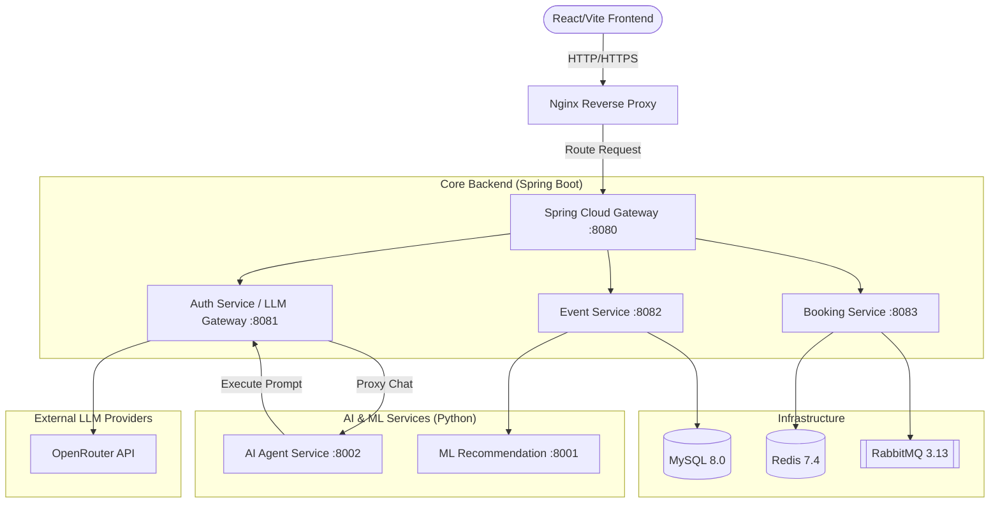

# 🎫 Nexora Event Booking Platform & AI Assistant

**Live Demo:** [https://eventshublimited.netlify.app/](https://eventshublimited.netlify.app/)

[](https://github.com/Mahesh5f4/event-management-system/actions/workflows/backend-ci.yml)
[](https://openjdk.org/projects/jdk/17/)
[](https://spring.io/projects/spring-boot)
[](./ai-service)
[](#)
[](./backend/docker-compose.yml)
[](./LICENSE)

> A high-availability, microservices-based distributed event ticketing platform, supercharged with a **Think-Action AI Agent** and a dynamic **LLM Gateway** for real-time, context-aware user assistance.

---

## 📖 Overview

**Nexora** (formerly EventHub) is a full-stack platform that allows users to discover events, receive ML-powered recommendations, and book tickets with guaranteed seat allocation. 

To elevate the user experience, Nexora features a **Think-Action AI Assistant** powered by a LangGraph agent. The agent can answer questions, perform RAG (Retrieval-Augmented Generation) on event data, and execute web searches, all streamed in real-time to the frontend through a custom Java Spring Boot **LLM Gateway**.

---

## ✨ Key Features

### 🧠 AI & LLM Capabilities
*   **Think-Action AI Agent:** A Python/FastAPI LangGraph agent that classifies intents, performs RAG via Qdrant, and orchestrates Web Searches via Tavily.
*   **LLM Gateway (Provider Routing):** A centralized Spring Boot gateway that securely manages API keys and dynamically routes prompts to multiple providers.
*   **Multi-Model Support:** Built-in integration with **OpenRouter** (`openrouter/free`).
*   **Real-time Streaming:** End-to-end Server-Sent Events (SSE) streaming from the external LLM provider, through the Java Gateway, to the React frontend for a typewriter-like chat experience.

### 🎫 Event & Ticketing Core
*   **Distributed Seat Locking:** Atomically locks seats during checkout using Redis `SETNX` to prevent concurrent reservation conflicts (Lost Update Problem).
*   **Asynchronous Processing:** Offloads heavy tasks like PDF ticket generation and email notifications to RabbitMQ, drastically reducing API latency.
*   **ML-Powered Recommendations:** TF-IDF + cosine similarity engine for personalized event recommendations.
*   **Real-time Updates:** WebSocket integration (STOMP) for broadcasting live seat availability updates to all connected clients.
*   **Digital Passes & PDF Tickets:** Auto-generates downloadable PDF tickets with ZXing QR codes.

---

## 🏛️ System Architecture

Nexora utilizes a modular 3-tier microservices architecture designed for horizontal scalability, fault isolation, and high availability.

### Overall System Flow



### The AI Request Flow (Frontend to LLM Gateway)

1. **Initiation:** User submits a prompt. React frontend opens an SSE connection to the Backend.
2. **Proxy:** Spring Boot Backend packages the conversation history and forwards it to the Python AI Service via an internal REST call.
3. **Orchestration:** The LangGraph agent (Python) classifies the intent, performs RAG/Web Search, and compiles the final prompt.
4. **Execution:** The AI Service calls *back* to the Spring Boot **LLM Gateway**.
5. **Generation & Streaming:** The Gateway selects the configured provider (e.g., Gemini), executes the prompt, and cascades the token stream all the way back to the frontend.

---

## 🛠️ Tech Stack

*   **Frontend:** React 19, Vite, Redux Toolkit, GSAP Animations, Framer Motion.
*   **Backend (Core):** Spring Boot 3.4 (Java 17), Spring Cloud Gateway, Spring Security.
*   **AI Service:** Python 3.12, FastAPI, LangGraph, Qdrant (Vector DB), Tavily (Web Search).
*   **Data & State:** MySQL 8.0 (Persistent Data), Redis 7.4 (Distributed Locks, Caching).
*   **Message Broker:** RabbitMQ 3.13 (Async Task Execution).

---

## 🚀 Quick Start

### 1. Prerequisites
- Docker & Docker Compose
- Java 17 + Maven
- Python 3.12
- Node.js 20+

### 2. Environment Variables
Create a `.env` file in the `backend/` directory with your LLM Gateway keys:
```env
OPENROUTER_API_KEY=your_openrouter_key
AI_SERVICE_INTERNAL_TOKEN=secure_internal_token
```
Create a `.env` file in the `ai-service/` directory for the agent:
```env
TAVILY_API_KEY=your_tavily_key
QDRANT_API_KEY=your_qdrant_key
AI_SERVICE_INTERNAL_TOKEN=secure_internal_token
```

### 3. Run the Infrastructure
Spin up the required databases and message brokers:
```bash
docker-compose up -d mysql redis rabbitmq
```

### 4. Start the Microservices
You can use the provided batch scripts (Windows) or run them manually:
```bash
# Start backend services
./mvnw spring-boot:run -pl auth-service
./mvnw spring-boot:run -pl event-service
./mvnw spring-boot:run -pl booking-service

# Start Python AI Service
cd ai-service
pip install -r requirements.txt
uvicorn app.main:app --port 8002 --reload

# Start Frontend
cd frontend
npm install
npm run dev
```

---

## 📄 License
This project is licensed under the MIT License - see the [LICENSE](LICENSE) file for details.
