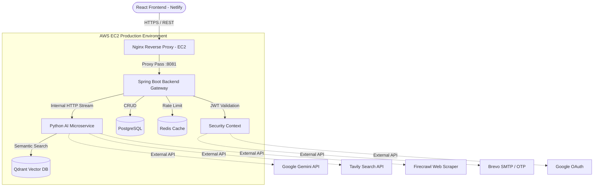

# 🧠 ThinkAction AI (Nexora)

**Live Demo:** [https://thinkactionai.netlify.app/](https://thinkactionai.netlify.app/)

[](https://react.dev/)
[](https://spring.io/projects/spring-boot)
[](https://fastapi.tiangolo.com/)
[](https://qdrant.tech/)
[](#)

> A highly scalable, unified Agentic AI workspace that integrates distinct cognitive roles (Researcher, Planner, Knowledge Base) with enterprise-grade Retrieval-Augmented Generation (RAG) and real-time web connectivity.

---

## 📖 Overview

**ThinkAction AI** solves the fragmentation of modern generative AI tools by providing a single, centralized workspace where users can seamlessly switch between specialized AI agents. 

Rather than relying on generic, zero-shot prompting, the system implements **Agent Roles**. Each role is backed by a dynamically constructed system prompt and specialized tool access (e.g., deep web research via Tavily, web scraping via Firecrawl, or strict semantic document retrieval via Qdrant), orchestrated by a powerful Python microservice and governed by a highly secure Spring Boot API Gateway.

---

## ✨ Key Features

### 🤖 Multi-Agent Cognitive Roles
*   **Researcher:** Equipped with Tavily and Firecrawl APIs to perform real-time internet research, analyze search results, and synthesize up-to-date factual reports, eliminating LLM hallucination on recent events.
*   **Knowledge Base:** Strictly grounded to the internal Qdrant vector database. Performs Approximate Nearest Neighbor (ANN) search to provide answers based *only* on ingested enterprise documents.
*   **Planner:** Engineered to break down complex architectural or strategic requests into actionable, numbered milestones.
*   **General & Analyze:** Optimized for coding, logical reasoning, and data analysis.

### ⚡ Premium UI & Smooth Streaming
*   **Word-by-Word Easing Algorithm:** Features a custom React hook that buffers raw, chunked network streams from the LLM and interpolates the text rendering at 60fps, replicating the buttery-smooth typewriter effect of premium commercial AI platforms.
*   **Markdown & Syntax Highlighting:** Real-time parsing of complex markdown, tables, and code blocks with automatic hallucinated-backtick sanitization.

### 🏛️ Distributed Microservices Backend
*   **Spring Boot Gateway:** Handles JWT authentication, OTP email verification (via Brevo), Google OAuth2, rate limiting (Redis), and PostgreSQL user data management.
*   **Python Cognitive Core:** A dedicated FastAPI microservice that handles LangChain orchestrations, dense vector embeddings, and real-time LLM streaming via the Gemini API.

---

## 🏗️ System Architecture

ThinkAction AI utilizes a containerized, 3-tier microservices architecture designed for absolute separation of concerns.

### High-Level Architecture Flow



### The RAG & Agent Flow

1. **User Intent:** The user selects an Agent Role (e.g., "Researcher") and submits a prompt.
2. **Gateway Verification:** The React frontend opens a stream to the Spring Boot backend. Spring Boot validates the user's JWT and checks Redis for rate limits.
3. **Cognitive Routing:** Spring Boot forwards the request to the Python FastAPI service.
4. **Tool Orchestration:** 
   * If *Knowledge Base*, Python embeds the query and fetches relevant context chunks from **Qdrant**.
   * If *Researcher*, Python executes a search query via **Tavily**.
5. **LLM Execution:** The retrieved context and dynamic system prompt are sent to **Gemini**.
6. **Smooth Cascading:** The response is streamed from Gemini $\rightarrow$ Python $\rightarrow$ Spring Boot $\rightarrow$ React Frontend.

---

## 🛠️ Tech Stack

*   **Frontend:** React 19, Vite, TailwindCSS, Redux Toolkit, Framer Motion.
*   **Backend Gateway:** Java 17, Spring Boot 3, Spring Security (JWT), Hibernate.
*   **AI Service:** Python 3.12, FastAPI, LangChain.
*   **Data Layer:** PostgreSQL (Relational), Qdrant (Vector Embeddings), Redis (Caching).
*   **External APIs:** Google Gemini, Tavily, Firecrawl, Brevo, Google OAuth.
*   **Infrastructure:** AWS EC2, Netlify, Nginx, Docker Compose.

---

## 🚀 Quick Start (Development)

### 1. Prerequisites
- Docker & Docker Compose
- Java 17 + Maven
- Python 3.12
- Node.js 20+

### 2. Environment Variables
Create a `.env` file in the `backend/` directory:
```env
SPRING_DATASOURCE_URL=jdbc:postgresql://localhost:5432/nexora
SPRING_DATASOURCE_USERNAME=nexora
SPRING_DATASOURCE_PASSWORD=password
SPRING_REDIS_URL=redis://localhost:6379
GOOGLE_CLIENT_ID=your_google_client_id
BREVO_API_KEY=your_brevo_key
```

Create a `.env` file in the `ai-service/` directory:
```env
GEMINI_API_KEY=your_gemini_key
TAVILY_API_KEY=your_tavily_key
FIRECRAWL_API_KEY=your_firecrawl_key
QDRANT_URL=http://localhost:6333
```

### 3. Spin up Infrastructure
Run the required databases (PostgreSQL, Redis, Qdrant) via Docker:
```bash
docker-compose up -d postgres redis qdrant
```

### 4. Start Microservices

**Terminal 1 (Backend Gateway):**
```bash
./mvnw spring-boot:run -pl auth-service
```

**Terminal 2 (AI Service):**
```bash
cd ai-service
pip install -r requirements.txt
uvicorn app.main:app --port 8000 --reload
```

**Terminal 3 (Frontend):**
```bash
cd frontend
npm install
npm run dev
```

---

## 📄 License
This project is licensed under the MIT License - see the [LICENSE](LICENSE) file for details.
