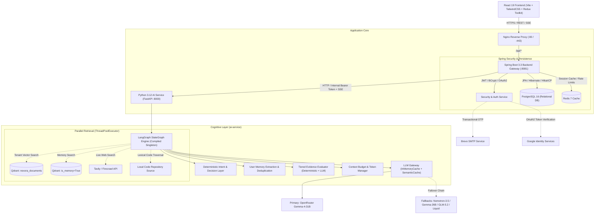
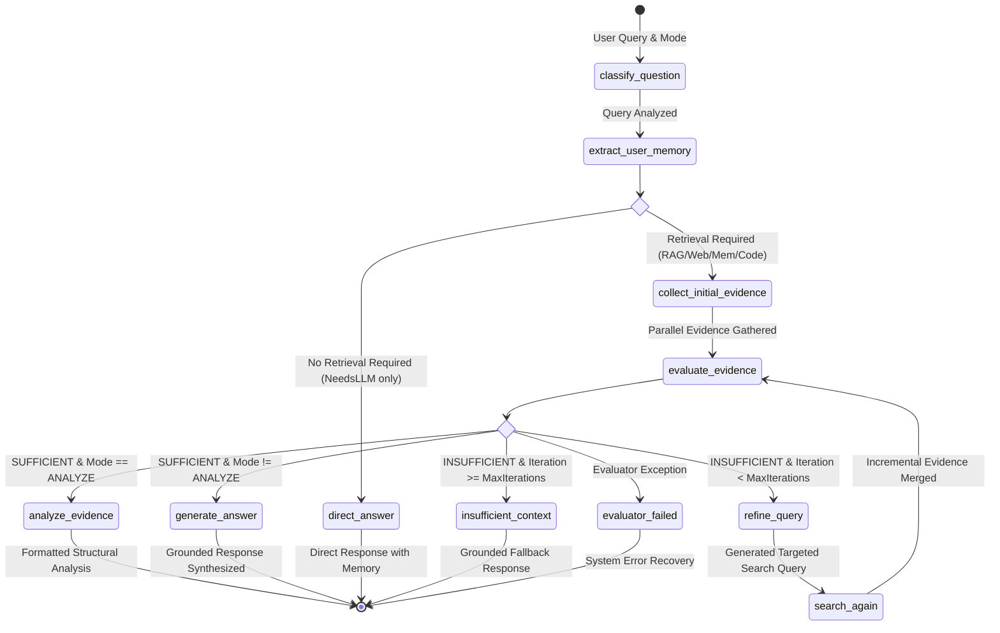
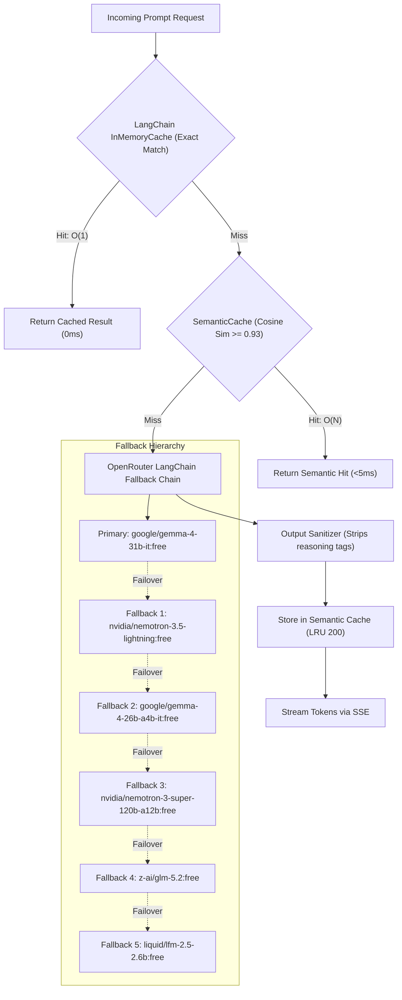

# ThinkAction AI

<div align="center">

**An agentic AI workspace unifying multi-agent reasoning, iterative evidence evaluation, persistent vector memory, repository intelligence, and enterprise RAG into a resilient microservices architecture.**

[](https://thinkactionai.netlify.app/)
[](https://react.dev/)
[](https://spring.io/projects/spring-boot)
[](https://fastapi.tiangolo.com/)
[](https://qdrant.tech/)
[](https://www.postgresql.org/)
[](https://redis.io/)

</div>

---

## 1. System Overview

### What is ThinkAction AI?
ThinkAction AI is an open-source, production-oriented **Agentic AI Workspace**. Rather than acting as a standard wrapper over a raw LLM API, ThinkAction AI treats large language models as one component within a deterministic, state-machine-controlled cognitive architecture. 

The platform orchestrates autonomous multi-source retrieval (Internal Documents, Live Web, User Memory, and Code Repositories), executes tiered evidence evaluation, manages strict token budgets, handles automated multi-provider LLM failover, and streams grounded responses to an interactive React workbench via Server-Sent Events (SSE).

```
                      ┌──────────────────────────────────────────────┐
                      │              ThinkAction AI                  │
                      │  Unified Multi-Agent Cognitive Architecture  │
                      └──────────────────────┬───────────────────────┘
                                             │
      ┌──────────────────┬───────────────────┼───────────────────┬──────────────────┐
      ▼                  ▼                   ▼                   ▼                  ▼
┌───────────┐      ┌───────────┐       ┌───────────┐       ┌───────────┐      ┌───────────┐
│  General  │      │  Deep Web │       │ Enterprise│       │Structural │      │ Codebase  │
│   Chat    │      │ Research  │       │ Knowledge │       │ Analysis  │      │Intelligence│
│ (Memory)  │      │  (Tavily) │       │ (Qdrant)  │       │(Validator)│      │(Traversal)│
└───────────┘      └───────────┘       └───────────┘       └───────────┘      └───────────┘
```

### Who is it for?
* **Engineers & Researchers:** Who require answers grounded in verifiable citations, local source code, and live web research without hallucinated facts.
* **Technical Teams:** Ingesting proprietary documentation, technical specifications, and architectural diagrams with tenant-isolated vector retrieval.
* **Architects & Developers:** Seeking a reference implementation of a distributed, hybrid **Java/Spring Boot + Python/FastAPI + LangGraph** microservices topology.

### Why is it different?
1. **Deterministic Guardrails Before Generation:** LLM calls are expensive and prone to stochastic drift. ThinkAction AI executes deterministic heuristic routing, length gating, and similarity score thresholds before triggering model reasoning.
2. **Tiered Evidence Evaluation & Self-Correction:** Retrieved context is verified for sufficiency. If evidence is lacking, the LangGraph state machine computes missing facets, generates a refined query, and iteratively re-searches up to bounded safety limits.
3. **True Long-Term Vector Memory:** Unlike ephemeral session history, user preferences and facts are extracted via JSON schema, deduplicated against existing knowledge, and persisted in Qdrant with tenant isolation.
4. **Dual-Layer Caching:** Combines exact-match in-memory caching with a thread-safe cosine-similarity semantic query cache ($0.93$ threshold) to resolve common rephrasings with zero upstream LLM latency.
5. **Grounded Output Validation:** An analysis validation layer scans generated output to detect and intercept fabricated URLs, ungrounded dates, and unacknowledged contradictions before final presentation.

---

## 2. System Architecture

ThinkAction AI enforces strict separation of concerns through a 3-tier distributed microservices topology deployed across container boundaries.



---

## 3. End-to-End Request Lifecycle

The diagram below illustrates the path of an SSE streaming message from initial user input to final token rendering:


---

## 4. LangGraph Cognitive Orchestration

The core intelligence layer in `ai-service/app/agent/graph.py` is implemented as a compiled cyclic `StateGraph` backed by an immutable `AgentState` schema.



### Graph Execution Nodes
* **`classify_question`**: Deterministic decision layer executing pre-compiled regex intent trees (`_RAG_PATTERNS`, `_WEB_PATTERNS`, `_MEMORY_PATTERNS`, `_CODE_PATTERNS`, `_PLAN_PATTERNS`, `IDENTITY_PHRASES`). Flags active modalities without incurring LLM token costs.
* **`extract_user_memory`**: Detects first-person factual statements (`"I work with Kubernetes"`, `"My name is Alex"`). Prompts the LLM to output a strict JSON payload with `extracted_fact` and conflicting `delete_ids`, updating Qdrant memory vectors dynamically.
* **`collect_initial_evidence`**: Uses Python's `concurrent.futures.ThreadPoolExecutor(max_workers=4)` to parallelize I/O across Qdrant vector retrieval, live web scraping, and local code search. Evidence items are deduplicated using MD5 content hashing.
* **`evaluate_evidence`**: Executes a two-tier evaluation strategy. Tier 1 executes deterministic heuristics (minimum score threshold $\ge 0.30$, minimum character count $\ge 100$). If ambiguous, Tier 2 executes a structured LLM evaluation returning `{sufficient: bool, reason: str, missing_information: list}`.
* **`refine_query` & `search_again`**: When evidence is insufficient, extracts the missing semantic dimensions, formulates an expanded query, and re-executes search tools up to `max_iterations = 3`.
* **`analyze_evidence`**: Applies deterministic evidence ranking (memory $\to$ documents $\to$ web) and preserves contradiction candidates (Jaccard lexical overlap $> 0.40$) for multi-perspective synthesis.
* **`generate_answer`**: Injects selected context into a structured prompt, applies system-prompt memory facts, and configures generation parameters.

---

## 5. Core Subsystems Deep Dive

### A. RAG Architecture & Multi-Tenant Vector Store
* **Document Processing (`document_processor.py`):** Ingests PDF, TXT, MD, and DOCX files. Normalizes whitespace and extracts raw text streams.
* **Chunking (`chunker.py`):** `CharacterChunker` executes deterministic splitting at `chunk_size = 500` characters with `chunk_overlap = 50` characters. Respects structural boundaries (`\n\n` $\to$ `\n` $\to$ whitespace).
* **Embedding Model (`embedding.py`):** Local `sentence-transformers` running `all-MiniLM-L6-v2` generating 384-dimensional dense vectors on CPU. Features an in-memory bound LRU cache (`maxsize=512`) for single query embeddings.
* **Vector Database (`vector_store.py`):** Qdrant collection `nexora_documents`. Enforces **strict multi-tenant isolation** using query payload filters:
  ```python
  user_filter = Filter(must=[FieldCondition(key="user_id", match=MatchValue(value=user_id))])
  ```
* **Deterministic Point IDs:** Vector UUIDs are computed deterministically via `uuid.uuid5(NAMESPACE_OID, f"{user_id}:{document_id}:{chunk_index}")`.

```
Raw File Upload ──► Chunker (500 chars, 50 overlap) ──► all-MiniLM-L6-v2 (384-d) ──► Qdrant (user_id partition)
```

---

### B. Persistent Memory Architecture
ThinkAction AI distinguishes between **session conversation history** (stored relationally in PostgreSQL) and **long-term semantic memory** (stored as vector embeddings in Qdrant).

```
User Query: "I prefer working with Spring Boot instead of Django."
      │
      ▼
classify_question ──► extract_user_memory (LLM JSON Extraction)
                              │
                              ▼
                {
                  "extracted_fact": "User prefers working with Spring Boot instead of Django",
                  "delete_ids": ["prev-uuid-django-preference"]
                }
                              │
            ┌─────────────────┴─────────────────┐
            ▼                                   ▼
Qdrant: Delete old vectors            Qdrant: Upsert new vector
                                      (metadata: is_memory=True)
```
When future queries are executed, active user memories are fetched, filtered for relevance, and automatically injected into the LLM system prompt:
```text
Here are personal facts you know about this user:
- User prefers working with Spring Boot instead of Django
```

---

### C. Codebase Intelligence & Retrieval
`CodeRetrievalService` (`code_retrieval.py`) provides localized repository context extraction:
* **Directory Filtering:** Recursively scans the workspace, ignoring `.git`, `node_modules`, `target`, `venv`, `__pycache__`, `build`, `dist`, `.idea`, and `.vscode`.
* **Heuristic Scoring:** Computes relevance scores based on file path matches ($+0.5$), exact symbol/keyword line hits ($+1.0$), and surrounding structural tokens.
* **Context Extraction:** Extracts a balanced sliding window of $\pm 15$ lines around keyword matches and heuristically identifies enclosing class or function signatures (`_guess_symbol`).
* **Safety Bounds:** Hard-capped at 5.0 seconds maximum execution time per query to prevent I/O blocking.

---

### D. LLM Gateway, Fallback Chain & Semantic Caching
The Python `LLMGateway` (`llm_gateway.py`) wraps model invocations with multi-layer caching and automated failover.



* **Cache Key Normalization:** Strips internal RAG context wrappers and embeds *only* the user's core query to prevent document text from distorting semantic similarity.
* **Thread-Safe Semantic Cache (`semantic_cache.py`):** Maintains up to 200 embeddings in memory. Computes vector dot product cosine similarity over query vectors. Rephrased questions with similarity $\ge 0.93$ return cached outputs immediately.
* **Reasoning Sanitizer:** Automatically filters raw `<think>...</think>` tags and reasoning artifacts from thinking models before dispatching to clients.

---

### E. Context Budgeting & Token Management
`ContextManagerService` (`context_manager.py`) guarantees that prompts strictly conform to model context windows:
* **Token Estimation:** Calculates token counts using bounded estimator heuristics.
* **Budget Allocation:** Enforces a default limit of $3,500$ input tokens with $1,000$ reserved output tokens.
* **Priority-Based Evidence Pruning:** Gated by configurable safety settings:
  * `safety_max_rag_chunks`: 5 chunks maximum
  * `safety_max_chars_per_rag_chunk`: 1,200 chars maximum
  * `safety_max_web_results`: 5 results maximum
  * `safety_max_chars_per_web_result`: 1,000 chars maximum
  * `safety_max_total_evidence_chars`: 6,000 chars maximum
* **Truncation Protocol:** Gracefully appends `"... [truncated]"` when individual items exceed allocated token slices.

---

### F. Output Validation & Hallucination Mitigation
`AnalysisOutputValidator` (`validator.py`) inspects generated responses against the retrieved evidence set before final delivery:
1. **Fabricated URL Detection:** Extracts all HTTP/HTTPS links in the generated text; rejects any response containing URLs not present in the retrieved evidence objects.
2. **Fabricated Date Detection:** Flags specific date references not confirmed by evidence publication dates or content.
3. **Certainty Checking:** Emits warnings if absolute claims (`"definitely"`, `"always"`, `"proves"`) are generated without accompanying evidence.
4. **Contradiction Verification:** Verifies that conflicting evidence sources are explicitly acknowledged in the response.

---

## 6. Streaming Protocol (Server-Sent Events)

ThinkAction AI delivers real-time streaming updates over standard HTTP using Server-Sent Events (SSE). The Python service streams structured events to Spring Boot, which relays them downstream with buffering disabled (`X-Accel-Buffering: no`).

| Event Type | Payload Schema | Description |
| :--- | :--- | :--- |
| `start` | `{}` | Handshake signal confirming graph execution has begun |
| `status` | `{"stage": "classify_question" \| "collect_initial_evidence" \| ...}` | Real-time stage transition updates for UI progress indicators |
| `metadata` | `{"needsWeb": bool, "needsRag": bool, "needsMemory": bool, ...}` | Emitted after intent classification to reveal active tools |
| `source` | `{"title": str, "url": str, "source_type": str, "relevance_score": float}` | Evidence citation objects emitted prior to generation |
| `token` | `{"text": "token_chunk"}` | Raw incremental token chunks generated by the LLM |
| `done` | `{}` | Completion signal closing the HTTP streaming connection |

```
Client (useSmoothStream) ◄── SSE Tokens ◄── Spring Boot (SseEmitter) ◄── FastAPI (StreamingResponse)
```

On the frontend, the custom React hook `useSmoothStream.js` buffers incoming chunks and interpolates token rendering via a `requestAnimationFrame` easing loop at 60fps, ensuring consistent typewriter delivery regardless of upstream packet batching.

---

## 7. Security & Isolation Model

ThinkAction AI implements defense-in-depth across authentication, transport, and data layers:

* **Stateless JWT Authentication:** Access tokens signed via HMAC-SHA256 with role-based authorization (`USER`, `ADMIN`).
* **Service-to-Service Authorization:** Spring Boot and FastAPI communicate over a private Docker network authenticated via shared internal bearer tokens (`X-Internal-Token`) and propagated user context (`X-User-Jwt`).
* **Multi-Tenant Vector Isolation:** All Qdrant search and deletion operations mandate a strict `user_id` payload match. It is architecturally impossible for one tenant to query or delete another tenant's vector points.
* **SSRF Prevention:** Web search providers validate outbound URLs, discarding `localhost`, `127.0.0.1`, `0.0.0.0`, and non-HTTP schemes.
* **SQL Injection & ORM Safety:** All relational persistence utilizes Spring Data JPA parameterized queries and Hibernate ORM.
* **Safe Secrets Management:** API keys, database credentials, and SMTP secrets are strictly injected via environment variables; none are hardcoded or checked into version control.

---

## 8. Data Architecture

| Storage Engine | Technology | Responsibility | Persistence Model |
| :--- | :--- | :--- | :--- |
| **Relational DB** | PostgreSQL 16 | User accounts, password hashes, conversation sessions, chat messages, document metadata | ACID Transactions / Volume Mount |
| **Vector DB** | Qdrant | 384-dimensional dense vector embeddings for RAG documents and persistent user memories | Memory-mapped storage / Disk volume |
| **Cache & State** | Redis 7 | User rate limiting, OTP verification codes, Spring session cache | In-memory with AOF disk persistence |
| **Local Cache** | Python In-Memory | LRU exact-match cache (`InMemoryCache`) + Cosine semantic query cache (`SemanticCache`) | Ephemeral process memory (200 entries) |

---

## 9. Technology Stack

<div align="center">

| Layer | Technologies |
| :--- | :--- |
| **Frontend** | React 19, Vite 6, TailwindCSS, Redux Toolkit, React Router 6, Framer Motion, Lucide Icons |
| **Backend Gateway** | Java 17, Spring Boot 3.3, Spring Security 6 (JWT), Spring Data JPA, Hibernate, HikariCP, Lombok |
| **AI Orchestration** | Python 3.12, FastAPI, LangGraph 0.2, LangChain Core, Pydantic v2, Uvicorn |
| **Vector & ML** | Qdrant, Sentence-Transformers (`all-MiniLM-L6-v2`), PyTorch (CPU-optimized), NumPy |
| **External APIs** | OpenRouter (Gemma / Nemotron / GLM), Tavily Search API, Firecrawl, Brevo SMTP, Google OAuth2 |
| **Infrastructure** | Docker, Docker Compose, Nginx 1.27 (Alpine), AWS EC2, Netlify |
| **Testing & Metrics** | Pytest, JUnit 5, Mockito, k6 Load Testing, Spring Boot Actuator, Micrometer Prometheus |

</div>

---

## 10. Repository Structure

```text
event-management-system/
├── frontend/                     # React 19 Client Application
│   ├── public/                   # Favicons, SVGs, webmanifest, static assets
│   ├── src/
│   │   ├── components/           # UI components, Chat interfaces, Navbar, Footer
│   │   ├── hooks/                # Custom hooks (useAgentStream, useSmoothStream)
│   │   ├── pages/                # Workspace, Dashboard, Knowledge, Profile, Auth
│   │   ├── store/                # Redux Toolkit slices (authSlice, chatSlice)
│   │   └── api/                  # Axios HTTP client configuration
│   └── package.json
│
├── backend/                      # Spring Boot 3.3 Microservices
│   ├── auth-service/             # Main API Gateway & Service Layer
│   │   └── src/main/java/com/EventmanagementbyMahesh/event/
│   │       ├── ai/               # AI Controllers (Conversation, Document, Memory)
│   │       ├── auth/             # Spring Security, JWT Filters, OAuth2, OTP
│   │       └── common/           # Error handling, global exceptions, utilities
│   ├── common-library/           # Shared DTOs and security abstractions
│   ├── docker-compose.yml        # Production multi-container composition
│   └── pom.xml                   # Maven root project definition
│
├── ai-service/                   # Python 3.12 Cognitive AI Microservice
│   ├── app/
│   │   ├── agent/                # LangGraph StateGraph, Evaluator, Validator, Tools
│   │   ├── api/                  # FastAPI endpoints (/internal/agent, /internal/rag)
│   │   ├── core/                 # App configuration & environment parsing
│   │   ├── models/               # Pydantic schemas (AgentState, EvidenceItem, DTOs)
│   │   └── services/             # LLM Gateway, Semantic Cache, Chunker, Qdrant Vector Store
│   ├── tests/                    # 31 Pytest test suites (Graph, RAG, Memory, Security)
│   └── requirements.txt          # Python dependencies
│
├── docs/                         # Architectural documentation and deployment guides
│   ├── benchmark/                # Empirical benchmark reports and load tests
│   └── AWS_DEPLOYMENT_GUIDE.md   # EC2 & Docker production deployment manual
│
└── README.md                     # Root technical documentation
```

---

## 11. Local Development & Setup

### Prerequisites
* **Docker & Docker Compose** (v24.0+)
* **Java Development Kit (JDK 17)** + Maven 3.9+
* **Python 3.12** + `pip`
* **Node.js 20+** + `npm`

---

### Step 1: Clone Repository
```bash
git clone https://github.com/Mahesh5f4/Nexora.git thinkaction-ai
cd thinkaction-ai/event-management-system
```

---

### Step 2: Configure Environment Variables

Create `backend/.env`:
```env
SPRING_DATASOURCE_URL=jdbc:postgresql://localhost:5432/nexora
POSTGRES_USER=nexora
POSTGRES_PASSWORD=password
SPRING_REDIS_URL=redis://localhost:6379
GOOGLE_CLIENT_ID=your_google_client_id.apps.googleusercontent.com
BREVO_API_KEY=your_brevo_api_key
SPRING_MAIL_USERNAME=your_email@example.com
SPRING_MAIL_PASSWORD=your_brevo_smtp_key
SPRING_MAIL_FROM=noreply@thinkaction.ai
AI_SERVICE_INTERNAL_TOKEN=super-secret-dev-token
AI_SERVICE_URL=http://localhost:8000
```

Create `ai-service/.env`:
```env
OPENROUTER_API_KEY=your_openrouter_api_key
QDRANT_URL=http://localhost:6333
TAVILY_API_KEY=your_tavily_api_key
AI_SERVICE_INTERNAL_TOKEN=super-secret-dev-token
SPRING_AI_GATEWAY_URL=http://localhost:8081
```

Create `frontend/.env`:
```env
VITE_API_URL=http://localhost:8081/api
```

---

### Step 3: Start Infrastructure Services (Docker)
Launch PostgreSQL, Redis, and Qdrant:
```bash
docker compose -f backend/docker-compose.yml up -d postgres redis qdrant
```

---

### Step 4: Run Microservices Locally

**Terminal 1 — Spring Boot Backend:**
```bash
cd backend
./mvnw spring-boot:run -pl auth-service
```
*Backend runs on `http://localhost:8081` (Context path: `/api`)*

**Terminal 2 — Python AI Service:**
```bash
cd ai-service
python -m venv venv
# Windows:
.\venv\Scripts\activate
# Linux/macOS:
source venv/bin/activate

pip install -r requirements.txt
uvicorn app.main:app --port 8000 --reload
```
*AI Service runs on `http://localhost:8000` (Docs: `/docs`)*

**Terminal 3 — React Frontend:**
```bash
cd frontend
npm install
npm run dev
```
*Frontend runs on `http://localhost:5173`*

---

## 12. Representative API Specification

### Authentication & User Management
| Method | Endpoint | Description | Auth Required |
| :--- | :--- | :--- | :--- |
| `POST` | `/api/auth/register` | Register new user account | Public |
| `POST` | `/api/auth/login` | Authenticate credentials & issue JWT | Public |
| `POST` | `/api/auth/google` | Authenticate via Google OAuth2 ID token | Public |
| `POST` | `/api/auth/send-otp` | Trigger email verification OTP via Brevo | Public |
| `GET` | `/api/auth/me` | Fetch authenticated user profile | User JWT |

### AI Conversation & Streaming
| Method | Endpoint | Description | Auth Required |
| :--- | :--- | :--- | :--- |
| `GET` | `/api/ai/conversations` | List user conversation sessions | User JWT |
| `POST` | `/api/ai/conversations` | Create a new conversation thread | User JWT |
| `POST` | `/api/ai/conversations/{id}/messages` | Synchronous prompt execution | User JWT |
| `POST` | `/api/ai/conversations/{id}/messages/stream` | Server-Sent Events (SSE) token stream | User JWT |
| `POST` | `/api/ai/conversations/{id}/generate-title`| Synthesize conversation title from prompt | User JWT |
| `DELETE`| `/api/ai/conversations/{id}` | Delete conversation thread & messages | User JWT |

### Knowledge Base & Vector Memory
| Method | Endpoint | Description | Auth Required |
| :--- | :--- | :--- | :--- |
| `POST` | `/api/ai/documents/upload` | Upload & index file into Qdrant | User JWT |
| `GET` | `/api/ai/documents` | List uploaded user documents | User JWT |
| `DELETE`| `/api/ai/documents/{id}` | Delete document & Qdrant vector chunks | User JWT |
| `GET` | `/api/ai/memory` | Retrieve long-term user memory facts | User JWT |
| `DELETE`| `/api/ai/memory/{memoryId}` | Delete specific long-term memory point | User JWT |

---

## 13. Testing, Evaluation & Quality Assurance

ThinkAction AI incorporates a multi-layer verification suite across Python and Java components:

```
├── ai-service/tests/                 # 31 Comprehensive Pytest Suites
│   ├── test_agent_graph.py           # LangGraph state transitions and edge routing
│   ├── test_research_loop.py         # Query refinement and multi-turn iterative search
│   ├── test_analyze_output_validation.py # Hallucinated URL and date interceptors
│   ├── test_memory_extraction.py     # JSON memory extraction and contradiction deletion
│   ├── test_context_safety.py        # Token budget safety and context truncation
│   ├── test_qdrant_integration.py    # Multi-tenant payload filtering & vector search
│   ├── test_chunker.py               # Deterministic character chunking boundary tests
│   └── test_embedding.py             # SentenceTransformer dimension & cache validation
│
├── backend/auth-service/src/test/    # JUnit 5 & Mockito Integration Tests
│   ├── AuthControllerTest.java       # JWT issuance, refresh, and login workflows
│   └── ConversationServiceTest.java  # Thread ownership and SSE stream relaying
│
└── tests/evaluation/                 # Synthetic Evaluation Benchmarks
    ├── evaluate_routing.py           # Heuristic router accuracy over 100-query dataset
    └── evaluate_rag.py               # Recall@K and MRR evaluation on Qdrant vectors
```

Run test suites locally:
```bash
# Run AI Service Unit Tests
cd ai-service
pytest -v

# Run Backend Unit Tests
cd backend
./mvnw test
```

---

## 14. Empirical Performance & Benchmarks

*Measurements extracted from documented production load tests on AWS EC2 (`docs/benchmark/THINKACTION_BENCHMARK.md`):*

### 1. Load & Concurrency (k6 SSE Load Testing)
* **Workload:** Concurrent active streaming sessions against `/api/ai/conversations/{id}/messages/stream`.
* **10 Virtual Users (VUs):**
  * **Success Rate:** $100.0\%$ (HTTP 2xx)
  * **Throughput:** $2.13\text{ req/sec}$
  * **Full Roundtrip Latency (p95):** $6.22\text{ seconds}$ (complete multi-turn graph execution and token stream)
  * **Stability:** Stable; Spring Boot and Nginx successfully buffered connections without dropped sockets.
* **25 Virtual Users (VUs):**
  * **Success Rate:** $30.6\%$ HTTP 2xx ($69.4\%$ HTTP 5xx)
  * **Finding:** Identified upstream LLM rate limiting (Free-Tier $429\text{ Too Many Requests}$ threshold), proving the need for Redis-based queue throttling under high concurrent burst loads.

### 2. RAG Retrieval Precision
* **Dataset:** Randomly sampled chunk verification against `nexora_documents` in Qdrant.
* **Recall@1:** $100.0\%$
* **Recall@3:** $100.0\%$
* **Mean Reciprocal Rank (MRR):** $1.0$

---

## 15. Architectural Trade-offs & Engineering Decisions

### 1. Spring Boot (Gateway) + FastAPI (AI Core)
* **Decision:** Split the platform into a Java Spring Boot backend and a Python FastAPI cognitive service.
* **Rationale:** Java/Spring Boot provides mature enterprise capabilities for relational data, transaction management, connection pooling (HikariCP), and Spring Security. Python is the undisputed standard for AI/ML tooling, vector embeddings, and LangGraph state machines.
* **Trade-off:** Introduces network hop overhead ($\approx 2-5\text{ms}$) between services, mitigated by internal HTTP streaming and shared private network bridges.

### 2. Deterministic Routing Before LLM Routing
* **Decision:** Execute regex intent matching prior to triggering LLM planning.
* **Rationale:** Prompting an LLM to decide whether to search the web costs $200-500\text{ms}$ and API tokens per request. Over $80\%$ of user intents can be classified deterministically in $<1\text{ms}$.
* **Trade-off:** Requires maintenance of comprehensive regex pattern lists; handled by a conservative fallback rule that favors grounding when ambiguous.

### 3. Server-Sent Events (SSE) vs. WebSockets
* **Decision:** Adopt SSE for real-time model streaming rather than bidirectional WebSockets.
* **Rationale:** LLM generation is inherently unidirectional (client sends prompt once, server streams response tokens). SSE operates over standard HTTP/HTTPS, natively supports reconnection, and works seamlessly through corporate proxies, firewalls, and Nginx load balancers without complex socket handshakes.
* **Trade-off:** Client cannot send messages over the same connection mid-stream; handled by standard cancellation POST endpoints.

### 4. Semantic Caching ($0.93$ Cosine Similarity)
* **Decision:** Implement an in-memory vector cache for near-duplicate prompt resolution.
* **Rationale:** Users frequently rephrase identical queries (e.g., *"How do I push a Docker image?"* vs *"Push image to docker"*). Semantic matching bypasses the LangGraph pipeline and LLM API entirely, dropping response latency from $3\text{s}$ to $<5\text{ms}$.
* **Trade-off:** High threshold ($0.93$) is strictly enforced to prevent returning false positives on nuanced queries.

---

## 16. Current Limitations & Roadmap

### Current Limitations
1. **Lexical Code Search:** The current codebase researcher uses lexical keyword scanning and sliding windows rather than AST (Abstract Syntax Tree) parsing or symbol call-graphs.
2. **Local In-Memory Cache:** The semantic cache is currently held in Python process memory rather than distributed Redis vector storage, resetting across worker restarts.
3. **Upstream Free-Tier Rate Limits:** Heavy concurrent streaming ($>15\text{ concurrent users}$) is bounded by free-tier LLM provider quotas.

---

### Product Roadmap

```
Near-Term (v1.1 - v1.2)
├── Redis-backed distributed semantic cache
├── Automated request queuing to smooth upstream LLM rate limits
└── Chunk-level AST parsing for Python, TypeScript, and Java codebases

Medium-Term (v2.0)
├── Multi-document comparative analysis workbench
├── Native support for self-hosted local models via Ollama / vLLM
└── Workspace team collaboration and role-based document access controls

Long-Term (v3.0)
├── Autonomous multi-step background research agents with sandboxed execution
├── Enterprise SSO (SAML 2.0 / Okta integration)
└── Continuous evaluation pipelines benchmarking retrieval accuracy against live datasets
```

---

## 17. Product Vision

ThinkAction AI is designed around a fundamental premise: **the future of AI interfaces is not a chat box—it is an autonomous, evidence-grounded workbench.**

Modern knowledge work demands systems that do not merely generate plausible-sounding text, but actively verify their own claims, cross-reference internal documents with external real-time data, retain persistent memory across working sessions, and strictly adhere to engineering safety guardrails. ThinkAction AI bridges this gap with a principled, production-grade microservices architecture.

---

## 18. Founder & Lead Engineer

ThinkAction AI is architected and built by:

**Mahesh Babu**  
*Founder & Lead Systems Architect*  
* Specialized in Distributed Backend Systems (Spring Boot), Agentic AI Workflows (LangGraph/FastAPI), and High-Performance Retrieval Architectures.
* GitHub: [@Mahesh5f4](https://github.com/Mahesh5f4)
* Project Repository: [ThinkAction AI (Nexora)](https://github.com/Mahesh5f4/Nexora.git)

---

## 19. License

This project is open-source software licensed under the [MIT License](LICENSE).
