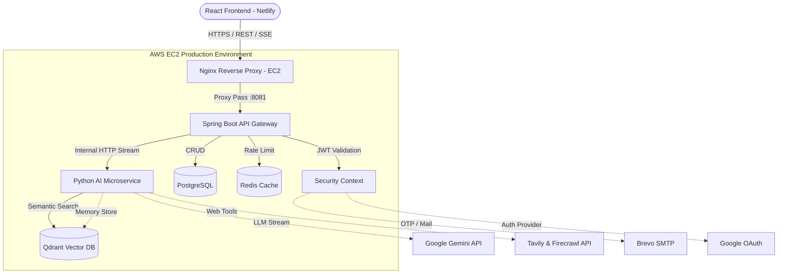

# 🧠 ThinkAction AI (Nexora)

**Live Demo:** [https://thinkactionai.netlify.app/](https://thinkactionai.netlify.app/)

[](https://react.dev/)
[](https://spring.io/projects/spring-boot)
[](https://fastapi.tiangolo.com/)
[](https://qdrant.tech/)
[](#)

> A highly scalable, unified Agentic AI workspace. Features a custom **LangGraph-driven orchestrator**, dynamic **multi-agent cognitive roles** (Researcher, Planner, Knowledge Base), continuous **Long-Term Vector Memory**, and enterprise-grade **Retrieval-Augmented Generation (RAG)**.

---

## 📖 Overview

**ThinkAction AI** solves the fragmentation of modern generative AI tools by providing a single, centralized workspace where users can seamlessly switch between specialized AI agents. 

Rather than relying on generic, zero-shot prompting, the system implements **Agent Roles**. Each role is backed by a dynamically constructed system prompt and specialized tool access, orchestrated by a powerful Python microservice running a **Stateful LangGraph Agent** and governed by a highly secure **Spring Boot API Gateway**.

---

## 🔬 Deep Dive: LangGraph & Cognitive Architecture

To prevent LLM hallucination and provide true reasoning capabilities, the Python AI Service utilizes [LangGraph](https://python.langchain.com/docs/langgraph) to orchestrate a cyclic, self-reflecting agent workflow. 

### The LangGraph State Machine
Every user request enters a compiled `StateGraph` that manages the execution state (`AgentState`). The graph executes the following nodes:

1. **`classify_question` (Source Decision Layer):** Evaluates the user query against highly optimized RegEx intent patterns (e.g., `_WEB_PATTERNS`, `_CODE_PATTERNS`, `_ANALYZE_PATTERNS`) to deterministically decide what type of retrieval is required (RAG, Web, Memory, or Code). This saves LLM cost by routing accurately before generating tokens.
2. **`extract_user_memory`:** Intelligently identifies if the user mentioned a new personal fact (e.g., "I am learning Rust"). It instructs the LLM to extract the fact as structured JSON, deduplicates it against old facts (e.g., deleting "I am learning Java"), and seamlessly injects it into Qdrant as a long-term memory vector.
3. **`collect_initial_evidence`:** A highly parallelized node utilizing Python's `ThreadPoolExecutor` to simultaneously fetch context from Qdrant (RAG), Qdrant (Memory), Tavily/Firecrawl (Web Search), and Local Repositories (Code Search). Context is deduplicated using MD5 content hashing.
4. **`evaluate_evidence`:** A tiered evaluation engine. 
   - *Tier-1 (Deterministic)* checks if evidence meets minimum similarity score thresholds.
   - *Tier-2 (Semantic)* uses the LLM to determine if the retrieved evidence actually answers the user's specific question.
5. **`refine_query` (The Loop):** If the evaluator determines the evidence is insufficient, this node calculates the *missing information*, generates a highly-targeted new search query, and cycles the LangGraph state back to evidence collection (up to a maximum iteration limit).

### 🧠 Advanced Memory Systems
The agent employs a three-tier memory architecture to ensure ultra-low latency and profound user personalization:

1. **Short-Term Context (Conversational):** React frontend maintains session state, passing chronological conversation history back to the LangGraph state on every request.
2. **Long-Term Vector Memory (Qdrant):** The agent constantly builds a psychological profile of the user. Facts extracted during the `extract_user_memory` graph node are embedded and saved to Qdrant with `is_memory: True` metadata. When the user asks "What is my favorite language?", the agent queries Qdrant specifically for user memories and synthesizes the answer.
3. **Semantic Query Cache (Thread-Safe LRU):** A highly optimized in-memory Python `SemanticCache`. Before executing the LangGraph, the user's query is embedded and compared against the cache using **Cosine Similarity**. If a query achieves a `> 0.93` similarity match with a previous question (e.g., "How do I push a docker image" vs "Push image to docker"), the gateway instantly returns the cached response, entirely bypassing the LLM and RAG pipeline for a massive performance gain.

---

## ✨ Key Features

### 🤖 Multi-Agent Cognitive Roles
*   **Researcher:** Equipped with Tavily and Firecrawl APIs to perform real-time internet research, looping through the LangGraph evaluator until facts are synthesized into an up-to-date report.
*   **Knowledge Base:** Strictly grounded to the internal Qdrant vector database. Performs Approximate Nearest Neighbor (ANN) search to provide answers based *only* on ingested enterprise documents.
*   **Planner:** Engineered to break down complex architectural or strategic requests into actionable, numbered milestones.

### ⚡ Premium UI & Smooth Streaming
*   **Word-by-Word Easing Algorithm:** Features a custom React hook (`useSmoothStream`) that buffers raw, chunked network streams from the LLM and interpolates the text rendering at 60fps, replicating the buttery-smooth typewriter effect of premium commercial AI platforms regardless of network latency.
*   **Markdown & Syntax Highlighting:** Real-time parsing of complex markdown, tables, and code blocks with automatic hallucinated-backtick sanitization.

### 🏛️ Distributed Microservices Backend
*   **Spring Boot Gateway:** Handles JWT authentication, OTP email verification (via Brevo), Google OAuth2, rate limiting (Redis), and PostgreSQL user data management. 
*   **Python Cognitive Core:** A dedicated FastAPI microservice that handles the LangGraph orchestrations, dense vector embeddings, and real-time LLM streaming via the Gemini API.

---

## 🏗️ System Architecture

ThinkAction AI utilizes a containerized, 3-tier microservices architecture designed for absolute separation of concerns.

### High-Level Architecture Flow



---

## 🛠️ Tech Stack

*   **Frontend:** React 19, Vite, TailwindCSS, Redux Toolkit, Framer Motion.
*   **Backend Gateway:** Java 17, Spring Boot 3, Spring Security (JWT), Hibernate.
*   **AI Service:** Python 3.12, FastAPI, LangGraph, LangChain.
*   **Data Layer:** PostgreSQL (Relational), Qdrant (Vector Embeddings/Memory), Redis (Caching).
*   **External APIs:** Google Gemini, Tavily, Firecrawl, Brevo, Google OAuth.
*   **Infrastructure:** AWS EC2, Netlify, Nginx, Docker Compose.

---

## 🚀 Quick Start (Development)

### 1. Prerequisites
- Docker & Docker Compose
- Java 17 + Maven
- Python 3.12
- Node.js 20+

### 2. Environment Variables
Create a `.env` file in the `backend/` directory:
```env
SPRING_DATASOURCE_URL=jdbc:postgresql://localhost:5432/nexora
SPRING_DATASOURCE_USERNAME=nexora
SPRING_DATASOURCE_PASSWORD=password
SPRING_REDIS_URL=redis://localhost:6379
GOOGLE_CLIENT_ID=your_google_client_id
BREVO_API_KEY=your_brevo_key
```

Create a `.env` file in the `ai-service/` directory:
```env
GEMINI_API_KEY=your_gemini_key
TAVILY_API_KEY=your_tavily_key
FIRECRAWL_API_KEY=your_firecrawl_key
QDRANT_URL=http://localhost:6333
```

### 3. Spin up Infrastructure
Run the required databases (PostgreSQL, Redis, Qdrant) via Docker:
```bash
docker-compose up -d postgres redis qdrant
```

### 4. Start Microservices

**Terminal 1 (Backend Gateway):**
```bash
./mvnw spring-boot:run -pl auth-service
```

**Terminal 2 (AI Service):**
```bash
cd ai-service
pip install -r requirements.txt
uvicorn app.main:app --port 8000 --reload
```

**Terminal 3 (Frontend):**
```bash
cd frontend
npm install
npm run dev
```

---

## 📄 License
This project is licensed under the MIT License - see the [LICENSE](LICENSE) file for details.
